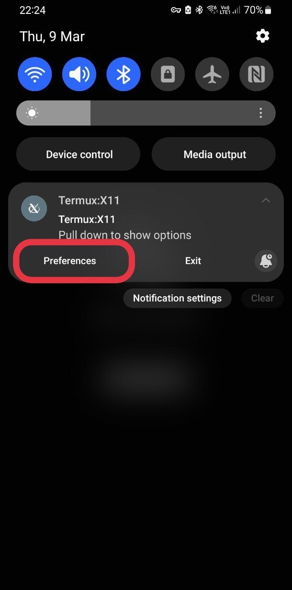

# Termux:X11

[](https://github.com/termux/termux-x11/actions/workflows/debug_build.yml) [](https://gitter.im/termux/termux) [](https://discord.gg/HXpF69X)

A [Termux](https://termux.com) X11 server add-on app.

## About
Termux:X11 is a fully fledged X server. It is built with Android NDK and optimized to be used with Termux.

## Submodules caveat
This repo uses submodules. Use 

```
~ $ git clone --recurse-submodules https://github.com/termux/termux-x11 
```
or
```
~ $ git clone https://github.com/termux/termux-x11
~ $ cd termux-x11
~ $ git submodule update --init --recursive
```

## How does it work?
Just like any other X server.

## Setup Instructions
For this one you must enable the `x11-repo` repository can be done by executing `pkg install x11-repo` command

For X applications to work, you must install Termux-x11 companion package. You can do that by downloading an artifact from [last successful build](https://github.com/termux/termux-x11/actions/workflows/debug_build.yml) and installing `*.apk` and `*.deb` (if you use termux with `pkg`) or `*.tar.xz` (if you use termux with `pacman`) files.
Or you can install nightly companion package from repositories with `pkg in x11-repo && pkg in termux-x11-nightly`

## Running Graphical Applications
You can start your desired graphical application by doing:
```
~ $ termux-x11 :1 &
~ $ env DISPLAY=:1 dbus-launch --exit-with-session xfce4-session
```
or
```
~ $ termux-x11 :1 -xstartup "dbus-launch --exit-with-session xfce4-session"
```
You may replace `xfce4-session` if you use other than Xfce

`dbus-launch` does not work for some users so you can start session with
```
~ $ termux-x11 :1 -xstartup "xfce4-session"
```

If you're done using Termux:X11 just simply exit it through it's notification drawer by expanding the Termux:X11 notification then "Exit"
But you should pay attention that `termux-x11` command is still running and can not be killed this way.

## Using with proot environment
If you plan to use the program with proot, keep in mind that you need to launch proot/proot-distro with the --shared-tmp option. 
If passing this option is not possible, set the TMPDIR environment variable to point to the directory that corresponds to /tmp in the target container.
If you are using proot-distro you should know that it is possible to start `termux-x11` command from inside proot container.

## Using with chroot environment
If you plan to use the program with chroot or unshare, you must to run it as root and set the TMPDIR environment variable to point to the directory that corresponds to /tmp in the target container. 
This directory must be accessible from the shell from which you launch termux-x11, i.e. it must be in the same SELinux context, same mount namespace, and so on.
Also you must set `XKB_CONFIG_ROOT` environment variable pointing to container's `/usr/share/X11/xkb` directory, otherwise you will have `xkbcomp`-related errors.
You can get loader for nightly build from an artifact of [last successful build](https://github.com/termux/termux-x11/actions/workflows/debug_build.yml)
```
export XKB_CONFIG_ROOT=/path/to/chroot/container/usr/share/xkb
export TMPDIR=/path/to/chroot/container/tmp
export CLASSPATH=/path/to/loader.apk
/system/bin/app_process / com.termux.x11.Loader :0
```

### Logs
If you need to obtain logs from the `com.termux.x11` application,
set the `TERMUX_X11_DEBUG` environment variable to 1, like this:
`TERMUX_X11_DEBUG=1 termux-x11 :0`

The log obtained in this way can be quite long.
It's better to redirect the output of the command to a file right away.

### Notification
In Android 13 post notifications was restricted so you should explicitly let Termux:X11 show you notifications.
<details>
<summary>Video</summary>

[img_enable-notifications.webm](https://user-images.githubusercontent.com/9674930/227760411-11d440eb-90b8-451e-9024-d5a194d10b16.webm)

</details>

Preferences:
You can access preferences menu three ways:
<details>
<summary>By clicking "PREFERENCES" button on main screen when no client connected.</summary>


</details>
<details>
<summary>By clicking "Preferences" button in notification, if available.</summary>


</details>
<details>
<summary>By clicking "Preferences" application shortcut (long tap `Termux:X11` icon in launcher). </summary>


</details>

## Touch gestures
### Touchpad emulation mode.
In touchpad emulation mode you can use the following gestures:
* Tap for click
* Double tap for double click
* Two-finger tap for right click
* Three-finger tap for middle click
* Two-finger vertical swipe for vertical scroll
* Two-finger horizontal swipe for horizontal scroll
* Three-finger swipe down to show-hide additional keys bar.
### Mouse emulation mode.
In touchpad emulation mode you can use the following gestures:
* Mouse is in click mode as long as you hold finger on a screen.
* Double tap for double click
* Two-finger tap for right click
* Three-finger tap for middle click
* Two-finger vertical swipe for vertical scroll
* Two-finger horizontal swipe for horizontal scroll
* Three-finger swipe down to show-hide additional keys bar.

## Font or scaling is too big!
Some apps may have issues with X server regarding DPI. please see https://wiki.archlinux.org/title/HiDPI on how to override application-specific DPI or scaling.

You can fix this in your window manager settings (in the case of xfce4 and lxqt via Applications Menu > Settings > Appearance). Look for the DPI value, if it is disabled enable it and adjust its value until the fonts are the appropriate size.
<details>
<summary> Screenshot </summary>

 
</details>

Also you can choose desired DPI in preferences of Termux:X11 app

## Using with 3rd party apps
It is possible to use Termux:X11 with 3rd party apps.
Check how `shell-loader/src/main/java/com/termux/x11/Loader.java` works.

# License
Released under the [GPLv3 license](https://www.gnu.org/licenses/gpl-3.0.html).
