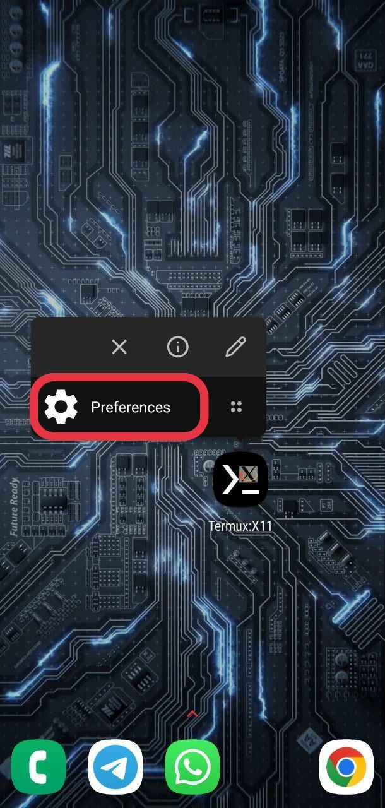
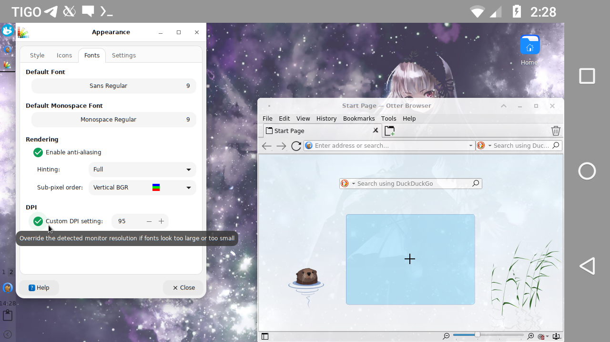

# Termux:X11

[](https://github.com/termux/termux-x11/actions/workflows/debug_build.yml) [](https://gitter.im/termux/termux) [](https://discord.gg/HXpF69X)

A [Termux](https://termux.com) X11 server add-on app.

## About
Termux:X11 is a fully fledged X server. It is built with Android NDK and optimized to be used with Termux.

## Submodules caveat
This repo uses submodules. Use 

```
~ $ git clone --recurse-submodules https://github.com/termux/termux-x11 
```
or
```
~ $ git clone https://github.com/termux/termux-x11
~ $ cd termux-x11
~ $ git submodule update --init --recursive
```

## How does it work?
Just like any other X server.

## Setup Instructions
Termux:X11 requires Android 8 or later. It consists of an Android app and a companion termux package, and you must install both.

The Android app is available via the [nightly release tag](https://github.com/termux/termux-x11/releases/tag/nightly) of this repository. Download and install the `app-$ARCHITECTURE-debug.apk` matching your device's CPU architecture. (You can choose `app-universal-debug.apk` if you are not sure which architecture to pick, and it'll use a few extra MB of storage.) 

The companion termux package is available from the termux graphical repository. You can ensure it's enabled and install this package with `pkg i x11-repo && pkg i termux-x11-nightly`. If you need to, you can also download a `.deb` or `*.tar.xz` from the same nightly release tag as above.

Finally, most people will want to use a desktop environment with Termux:X11. If you don't know what that means or don't know which one to pick, run `pkg i xfce` (also from `x11-repo`) to install a good one to start with. The rest of these instructions will assume that your goal is to run an XFCE desktop, or that you can modify the instructions as you follow them for your actual goal.

## Running Graphical Applications
You can start your desired graphical application by doing:
```
~ $ termux-x11 :1 -xstartup "dbus-launch --exit-with-session xfce4-session"
```
or
```
~ $ termux-x11 :1 &
~ $ env DISPLAY=:1 dbus-launch --exit-with-session xfce4-session
```
You may replace `xfce4-session` if you use other than Xfce

`dbus-launch` does not work for some users so you can start session with
```
~ $ termux-x11 :1 -xstartup "xfce4-session"
```

Also you can do 
```
export TERMUX_X11_XSTARTUP="xfce4-session"
termux-x11 :1
```
In this case you can same TERMUX_X11_XSTARTUP somewhere in `.bashrc` or other script and not type it every time you invoke termux-x11.  


If you're done using Termux:X11 just simply exit it through it's notification drawer by expanding the Termux:X11 notification then "Exit"
But you should pay attention that `termux-x11` command is still running and can not be killed this way.

For some reason some devices output only black screen with cursor instead of normal output so you should pass `-legacy-drawing` option.
```
~ $ termux-x11 :1 -legacy-drawing -xstartup "xfce4-session"
```

For some reason some devices show screen with swapped colours, in this case you should pass `-force-bgra` option.
```
~ $ termux-x11 :1 -force-bgra -xstartup "xfce4-session"
```

## Using with proot environment
If you plan to use the program with proot, keep in mind that you need to launch proot/proot-distro with the --shared-tmp option. 
If passing this option is not possible, set the TMPDIR environment variable to point to the directory that corresponds to /tmp in the target container.
If you are using proot-distro you should know that it is possible to start `termux-x11` command from inside proot container.

## Using with chroot environment
If you plan to use the program with chroot or unshare, you must to run it as root and set the TMPDIR environment variable to point to the directory that corresponds to /tmp in the target container. 
This directory must be accessible from the shell from which you launch termux-x11, i.e. it must be in the same SELinux context, same mount namespace, and so on.
Also you must set `XKB_CONFIG_ROOT` environment variable pointing to container's `/usr/share/X11/xkb` directory, otherwise you will have `xkbcomp`-related errors.
You can get loader for nightly build from an artifact of [last successful build](https://github.com/termux/termux-x11/actions/workflows/debug_build.yml)
Do not forget to disable SELinux
```
setenforce 0
export TMPDIR=/path/to/chroot/container/tmp
export CLASSPATH=$(/system/bin/pm path com.termux.x11 | cut -d: -f2)
/system/bin/app_process / com.termux.x11.CmdEntryPoint :0
```

### Force stopping X server (running in termux background, not an activity)

termux-x11's X server runs in process with name "app_process", not "termux-x11". But you can kill it by searching "com.termux.x11" in commandline.
So killing it will look like
```
pkill -f com.termux.x11
```

### Closing Android activity (running in foreground, not X server)

```
am broadcast -a com.termux.x11.ACTION_STOP -p com.termux.x11
```

### Logs
If you need to obtain logs from the `com.termux.x11` application,
set the `TERMUX_X11_DEBUG` environment variable to 1, like this:
`TERMUX_X11_DEBUG=1 termux-x11 :0`

The log obtained in this way can be quite long.
It's better to redirect the output of the command to a file right away.

### Notification
In Android 13 post notifications was restricted so you should explicitly let Termux:X11 show you notifications.
<details>
<summary>Video</summary>

[img_enable-notifications.webm](https://user-images.githubusercontent.com/9674930/227760411-11d440eb-90b8-451e-9024-d5a194d10b16.webm)

</details>

Preferences:
You can access preferences menu three ways:
<details>
<summary>By clicking "PREFERENCES" button on main screen when no client connected.</summary>


</details>
<details>
<summary>By clicking "Preferences" button in notification, if available.</summary>


</details>
<details>
<summary>By clicking "Preferences" application shortcut (long tap `Termux:X11` icon in launcher). </summary>


</details>

## Toggling keyboard
Just press "Back" button.

## Touch gestures
### Touchpad emulation mode.
In touchpad emulation mode you can use the following gestures:
* Tap for click
* Double tap for double click
* Two-finger tap for right click
* Three-finger tap for middle click
* Two-finger vertical swipe for vertical scroll
* Two-finger horizontal swipe for horizontal scroll
* Three-finger swipe down to show-hide additional keys bar.
### Simulated touchscreen mode.
In simulated touchscreen mode you can use the following gestures:
* Single tap for left button click.
* Long tap for mouse holding.
* Double tap for double click
* Two-finger tap for right click
* Three-finger tap for middle click
* Two-finger vertical swipe for vertical scroll
* Two-finger horizontal swipe for horizontal scroll
* Three-finger swipe down to show-hide additional keys bar.

## Font or scaling is too big!
Some apps may have issues with X server regarding DPI. please see https://wiki.archlinux.org/title/HiDPI on how to override application-specific DPI or scaling.

You can fix this in your window manager settings (in the case of xfce4 and lxqt via Applications Menu > Settings > Appearance). Look for the DPI value, if it is disabled enable it and adjust its value until the fonts are the appropriate size.
<details>
<summary> Screenshot </summary>

 
</details>

Also you can start `termux-x11` with `-dpi` option.
```
~ $ termux-x11 :1 -xstartup "xfce4-session" -dpi 120
```

## Changing, dumping and restoring preferences from commandline

It is possible to change preferences of termux-x11 from command line.
`termux-x11-nightly` package contains `termux-x11-preference` tool which can be used like 
```shell
termux-x11-preference [list] {key:value} [{key2:value2}]..."
```

Use `termux-x11-preference` to dump current preference.
Use `termux-x11-preference list > file` to dump current preferences to file.
Use `termux-x11-preferences < file` to restore preferences from file.
Use `termux-x11-preferences "fullscreen"="false" "showAdditionalKbd"="true"` to disable fullscreen and enable additional key bar. The full list of preferences you can modify is available with `termux-x11-preference list` command. You can specify one or more preferences here.

Termux:X11 activity should be available in background or foreground, otherwise `termux-x11-preferences` tool will hang indefinitely.
In the case if there is `Store preferences for secondary displays separately` preference active `termux-x11-preference` will use/modify preferences of display where Termux:X11 activity is currently opened.

## Using with 3rd party apps
It is possible to use Termux:X11 with 3rd party apps.
Check how `shell-loader/src/main/java/com/termux/x11/Loader.java` works.

# License
Released under the [GPLv3 license](https://www.gnu.org/licenses/gpl-3.0.html).
